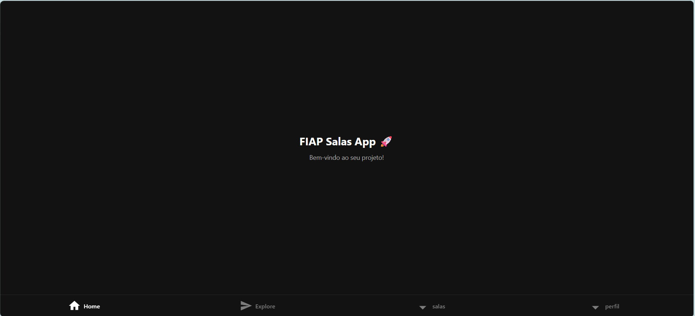
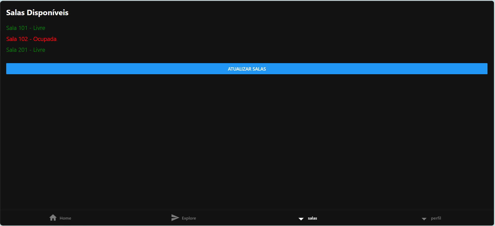
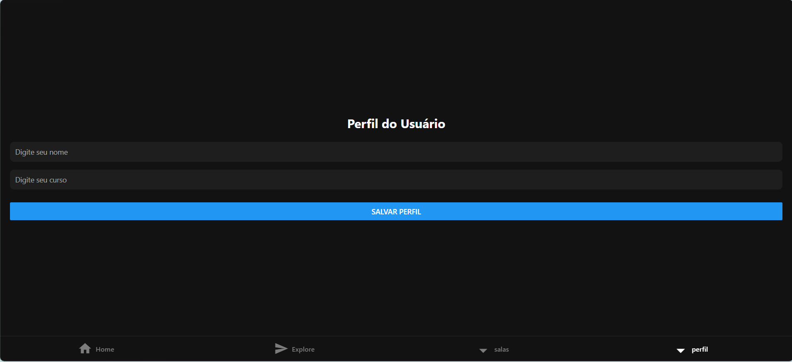

# 📱 FIAP Salas App

## 📌 a) Sobre o Projeto

Este projeto foi desenvolvido com o objetivo de simular um sistema de visualização de salas disponíveis dentro da FIAP.

A aplicação permite que o usuário visualize quais salas estão livres ou ocupadas, facilitando a organização e utilização dos espaços da instituição.

### 🚀 Funcionalidades

- Visualização de salas disponíveis
- Identificação de salas ocupadas/livres
- Navegação entre telas (Home, Salas e Perfil)
- Interface simples e intuitiva

---

## 👥 b) Integrantes do Grupo

- Pedro Tofoli

---

## ▶️ c) Como Rodar o Projeto

### 🔧 Pré-requisitos

- Node.js instalado
- npm instalado
- Expo CLI
- Navegador web ou app Expo Go

---

### 💻 Passo a passo

```bash
# Clonar o repositório
git clone https://github.com/Pedro184294/fiap-cpad-cp1-salas-app.git

# Entrar na pasta do projeto
cd fiap-cpad-cp1-salas-app

# Instalar dependências
npm install

# Rodar o projeto
npx expo start

Depois disso, você pode:

Pressionar w para abrir no navegador

Ou escanear o QR Code com o Expo Go

## 📱 d) Demonstração

### 🏠 Home


### 🏫 Salas


### 👤 Perfil


### 🎥 Vídeo do App
Demonstração do fluxo principal do aplicativo:

O usuário acessa a tela inicial (Home), navega até a aba de Salas para visualizar a disponibilidade e pode acessar o Perfil para visualizar seus dados.

⚙️ e) Decisões Técnicas
🏗️ Estrutura do Projeto

O projeto foi desenvolvido utilizando React Native com Expo, seguindo a estrutura padrão do Expo Router.

As telas foram organizadas dentro da pasta:

app/(tabs)

Telas criadas:

Home (index.tsx)

Salas (salas.tsx)

Perfil (perfil.tsx)

⚛️ Hooks Utilizados

useState: utilizado para controlar estados simples, como a lista de salas e informações exibidas nas telas.

useEffect: preparado para uso em futuras melhorias, como carregamento de dados externos.

🧭 Navegação

A navegação foi implementada utilizando o Expo Router com sistema de abas (tabs).

Abas disponíveis:

Home

Explore

Salas

Perfil

📱 Tecnologias Utilizadas

React Native

Expo

TypeScript

Expo Router